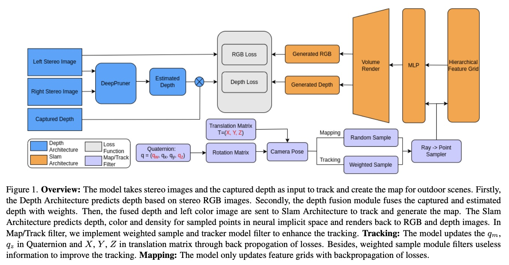
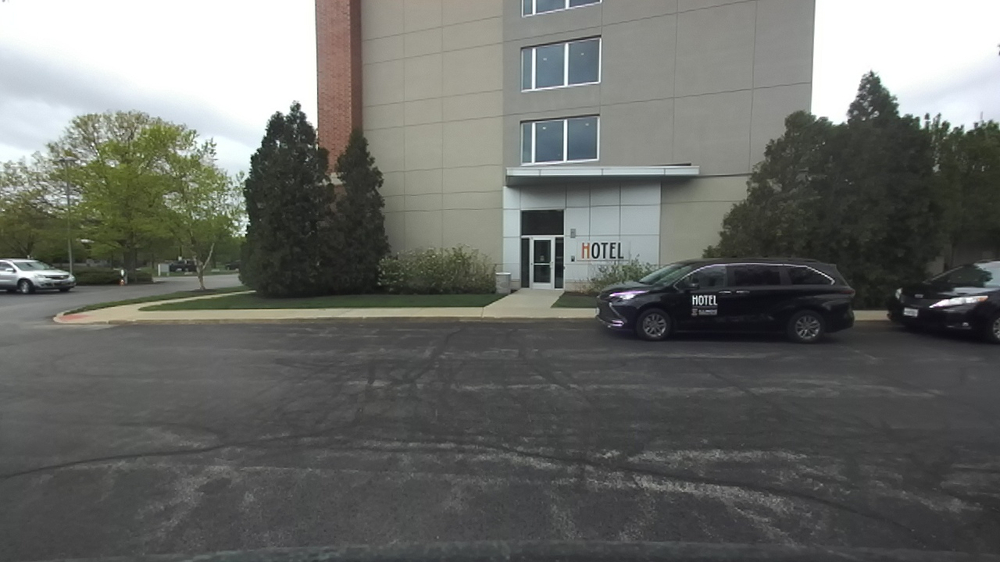
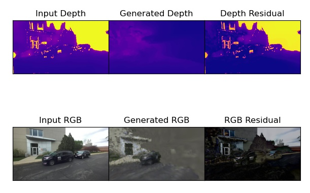

# Depth Fusion Visual SLAM

# Introduction
We present a depth fusion visual SLAM that enables stable SLAM in outdoor scenes using color and depth inputs. Our approach consists of a depth prediction architecture to enhance depth information and a SLAM architecture for tracking and map creation. We design a depth fusion technique to combine estimated depth with captured depth, refining the depth information. To improve and stabilize tracking, we introduce a tracker model filter that uses two quaternion parameters instead of nine rotation matrix parameters. We also develop a weighted sample module to filter irrelevant information for tracking. Our method is implemented on our own dataset, collected using a ZED 2 camera.




# Install and run
## Setup
To setup the environment:
```bash
sudo apt-get install libopenexr-dev
    
conda env create -f environment.yaml
conda activate DFVSlam
```
## Run
To run the Depth Fusion Visual SLAM, run the following command, change the yaml according to your config:
```bash
python -W ignore run.py configs/Highbay/parking.yaml
```

## Dataset
We implement our method on collected outdoor RosBag through ZED 2 camera. To extract images from Rosbag, run the script:
```bash
python rosbag2image.py
```
You need to modify the rosbag name, topic name accordingly. using ***generateAllFrame*** to extract alll information. Using ***shuffleData*** to shuffle training and testing dataset for finetune [DeepPruner](https://github.com/uber-research/DeepPruner) model. Using ***sampleData*** to generate data for Depth fusion Visual SLAM.

Data Structure:
  > DataSet \
  > |----- Left RGB Image \
  > |----- Depth Image 

Sample of left RGB data:



# Result
Our method is able to reconstruct the geometry in the rendered cube precisely within limited iterations. As shown in Fig, there are two frames of results with depth and color information. From left to right, we visualize the captured images, generated images, and residual images for color and depth.

The generated results successfully map the outdoor scene including cars and trees and filter things outside of the cube, such as the sky which represents gray. Besides, the correct render demonstrates the success of tracking. 



As shown in , our method has a low reconstruction render loss and its tracking loss compared with the ground truth pose is also very low.


